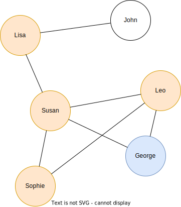

# UOM Social

### Social network app in Java using graph structure.

 

## Description

Simple social network application to demonstrate the use of the [JGraphT](https://github.com/jgrapht/jgrapht) library.

 

## Features

1. Register a new user.
2. Validate the email address using regular expressions.
3. Befriend other users.
4. Make posts.
5. Suggest new friends.
6. Save the registered users/posts/friendships.
7. Calculate the graph diameter.
8. Calculate the potential spread of a virus in the network.

 

## Explanation

#### Email format
The email needs to follow the format of the email system of the University of Macedonia.  

- `["ics" OR "iis" OR "dai"] + [3-5 digits] + ["@uom.edu.gr"]`

#### Graph
The graph structure is simple undirected graph.

#### Posts
Posts are visible to the author of the post and their friends.

#### Suggested friends
The suggested friends are the friends of your friends, who you are not already friends with, obviously.  

e.g. The suggested friends for George are: Lisa and Sophie.

#### Virus spread
The users that are potentially infected are a user's friends and the friends of them.  

e.g. The potentially infected users (if George has a virus) are: Susan, Lisa, Sophie and Leo.

#### Graph diameter

The graph diameter is calculated every time a new connection (friendship) is made.  

e.g. The diameter of the graphs in the previous two figures is **3**.

 
